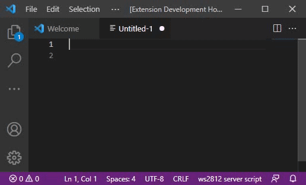

# ws2812svr Visual Studio Code Extension

## Features

Provides syntax highlighting, code completion for the Raspberry WS2812 Server programming language.  
To download the server to run these commands see:
[https://github.com/tom-2015/rpi-ws2812-server](https://github.com/tom-2015/rpi-ws2812-server)

## Requirements

Visual Studio Code  
Save files with .ws extension

## Extension Settings

none

## Known Issues

none, please report in github [https://github.com/tom-2015/rpi-ws2812svr-vsix.git](https://github.com/tom-2015/rpi-ws2812svr-vsix.git)

## Release Notes

### 1.0.0

Initial release